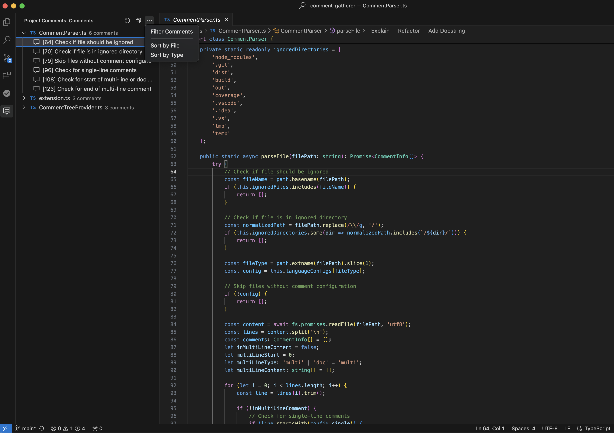

# Project Comment Gatherer

A powerful VS Code extension that helps you navigate and manage comments across your entire project. It automatically collects, organizes, and displays all comments from your codebase in an easy-to-navigate tree view, making code documentation more accessible than ever.

*Project Comment Gatherer showing organized comments in VS Code's explorer view*

## Why Project Comment Gatherer?

Managing and navigating through code comments in large projects can be challenging. This extension solves that problem by:

- **Centralizing Comments**: All your project's comments are gathered in one convenient location
- **Improving Documentation Access**: Quickly find and review documentation without digging through files
- **Enhancing Code Navigation**: Jump directly to any comment's location in your codebase
- **Supporting Documentation Workflows**: Export comments to create documentation or review code explanations

## Features

- **Automatic Comment Collection**: Automatically scans and collects comments from your project files
- **Multiple Comment Types**: Supports single-line, multi-line, and documentation comments
- **Wide Language Support**: Works with JavaScript, TypeScript, Python, Java, C++, C#, Go, Ruby, PHP, Swift, Kotlin, Scala, and Rust
- **Smart Organization**: Groups comments by file with an intuitive tree view
- **Powerful Navigation**: Click any comment to jump directly to its location in the code
- **Advanced Filtering**: Search and filter comments across your entire project
- **Export Capability**: Export all comments to a Markdown file for documentation

## Usage

1. Open your project in VS Code
2. Look for the "Project Comments" section in the Explorer sidebar
3. Click on any comment to navigate to its location
4. Use the toolbar buttons to:
   - Refresh the comment list
   - Filter comments
   - Sort comments by file or type
   - Export comments to Markdown

### Keyboard Shortcuts
- `Ctrl+Shift+C` (Windows/Linux) / `Cmd+Shift+C` (Mac): Focus the comment tree view
- `Ctrl+F` (Windows/Linux) / `Cmd+F` (Mac): Filter comments when tree view is focused

## Supported Languages

- JavaScript (.js, .jsx)
- TypeScript (.ts, .tsx)
- Python (.py)
- Java (.java)
- C/C++ (.c, .cpp, .h, .hpp)
- C# (.cs)
- Go (.go)
- Ruby (.rb)
- PHP (.php)
- Swift (.swift)
- Kotlin (.kt)
- Scala (.scala)
- Rust (.rs)

## Extension Settings

The extension activates automatically when you open VS Code and provides a clean, intuitive interface in the Explorer sidebar.

## Known Issues

- May experience performance issues with very large projects
- Limited to supported file types

## Contributing

Contributions are welcome! Please feel free to submit a Pull Request. For major changes, please open an issue first to discuss what you would like to change.

## License

This project is licensed under the MIT License - see the [LICENSE](LICENSE) file for details.

## Release Notes

### 0.1.0

Initial release of Project Comment Gatherer:
- Comment collection and organization
- File type detection
- Comment navigation
- Search and filter capabilities
- Export functionality
